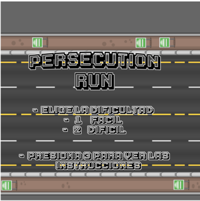
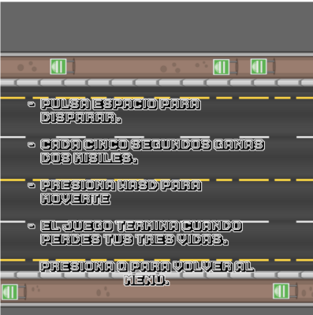
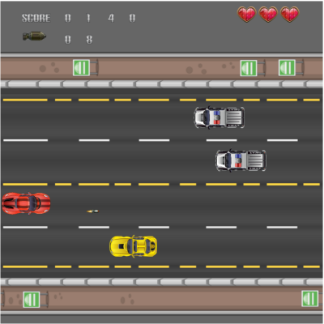

# Persecution run
## Equipo de desarrollo

- Magliotti Marcos
- Lucas Arias
- Monzon Cristian

## Capturas

## Reglas de Juego / Instrucciones

Persecution Run es un juego desarrollado Wollok, donde el jugador conduce por una carretera esquivando vehículos o eliminándolos con misiles. El objetivo es sumar la mayor cantidad de puntos posible sin chocar. El juego cuenta con dos niveles de dificultad: fácil y difícil. Todo el desarrollo fue realizado en equipo, con aportes en programación, diseño y jugabilidad por parte de todos los integrantes.

## Otros

- Comision 1/Unahur
- Versión de wollok  4.0.0
- Una vez terminado, no tenemos problemas en que el repositorio sea público
